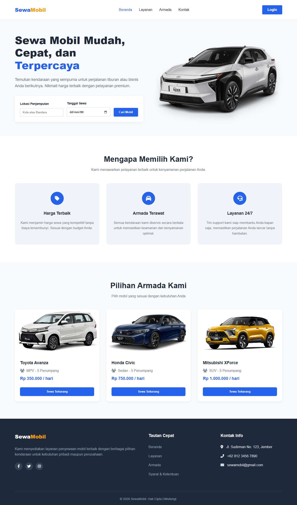

# 🚗 SewaMobil - Landing Page Car Rental

Proyek ini adalah *slicing* tampilan landing page penyewaan mobil (Car Rental) yang dibangun menggunakan HTML, CSS murni (Plain CSS), dan JavaScript DOM Manipulation.

## 🔗 Link Deployment & Repositori

* **Live Demo / Deployment:** [https://nama-project-kamu.vercel.app](https://sewa-mobil-nu.vercel.app/)
* **Repository GitHub:** [https://github.com/username-kamu/sewa-mobil](https://github.com/rickyegaa/Sewa-Mobil)

---

## 📸 Preview Tampilan



---

## ✨ Fitur Utama

1. **Fully Responsive Layout:** Tampilan menyesuaikan secara dinamis di berbagai ukuran layar (Desktop, Tablet, dan Mobile/Smartphone).
2. **Interactive Navigation:** Menu navigasi hamburger yang fleksibel untuk pengguna perangkat seluler (*mobile-friendly*).
3. **Dynamic Car Fleet Rendering:** Daftar armada mobil dirender secara dinamis dari data Array of Objects menggunakan JavaScript DOM Manipulation.
4. **Clean & Modern UI:** Menggunakan kombinasi warna profesional (Blue & Orange accent) dengan fitur *floating search box* dan latar belakang yang bersih.

---

## 🛠️ Teknologi yang Digunakan

* **HTML5:** Struktur semantik web.
* **CSS3 (Plain CSS):** Penataan tata letak menggunakan Flexbox, CSS Grid, dan Media Queries (Tanpa Framework seperti Bootstrap / Tailwind CSS).
* **JavaScript (ES6):** Manipulasi DOM untuk interaktivitas menu mobile dan pencetakan data armada.
* **FontAwesome:** Ikonografi untuk fitur dan kontak.

---

## 📁 Struktur Folder

```text
├── index.html      # Structure utama halaman web
├── style.css       # Style dan tata letak menggunakan Plain CSS
├── script.js       # Logika DOM JavaScript dan data dinamis
└── README.md       # Dokumentasi proyek
